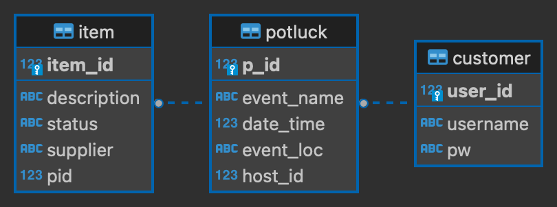

# Project 2: Potlukk

### Team 1:
Igor Gonevski, Grayson Howard, Matt Matthias, Zanetta Tyler

## Description
Your team will be building a potluck app, called Potlukk. Registered users create potlucks. Potlucks are have a list of items that the creator can specify. You will be using agile and DevOps practices. You must have daily standups and utilize Github actions. You can customize the name of the app as well as decide the aesthetic.

## Key Terms
- Potluck
    - A gathering of friends where each person brings something to eat
    - Attributes
        - time
        - date
        - creator
- Item
    - Something brought to a potluck
    - Attributes
        - Description
        - status
            - wanted/needed/fulfilled
        - supplier

## Entity Relationship Diagram

### Primary User Stories (Do First)
- As a registered User I can create a potluck (date and time required)
- As a registered User I can add items to potlucks I created
- As a registerd User I can remove items from potlucks I created
- As a guest I can view all potlucks
- As a guest I can add an item to a potluck, put down my name as the supplier
- As a guest I can create a Potlukk account
- As a guest I can login to a Potlukk account to become a registered User

### Primary User Stories (Secondary User Stories)
- As a registered User I can edit my potluck date/time
- As a registered User I can delete my potlucks
- As a registered User I can create a sharable link that goes directly to my potluck
- As a registered user I can create private potlucks that require a shareable link to be seen

### Technical Requirements
- Database postgresql
- Backend built in Spring Boot
- Frontend built with React

### Deployment Requirements
- Database deployed on RDS
- Backend containerzied with Docker and deployed on ECS
- Frontend statically hosted on S3

### Testing Requirements
- Perform TDD
- Have postman requests for all endpoints
